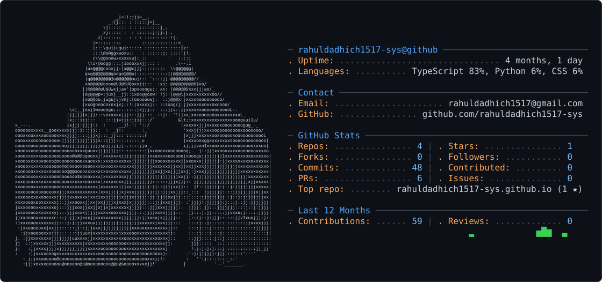

<picture>
  <source media="(prefers-color-scheme: dark)" srcset="dark_mode.svg" />
  <source media="(prefers-color-scheme: light)" srcset="light_mode.svg" />
  
</picture>

<p align="left">
  <a href="https://linkedin.com/in/rahul-dadhich-a40b67200">
    
  </a>
  <a href="mailto:rahuldadhich1517@gmail.com">
    
  </a>
</p>

---

## 🧑‍💻 About Me

I'm a **Full-Stack Web Developer with 2.4 years of experience** building scalable and high-performance web applications.

I work primarily with **React.js, Node.js, Express.js, TypeScript, SQL, and Azure**, with hands-on experience building production applications, reusable UI systems, authentication flows, APIs, state management architectures, and containerized environments.

```text
💻 Full-Stack Development
⚛️ React.js & Next.js
🟢 Node.js & Express.js
🔷 TypeScript & JavaScript
☁️ Microsoft Azure
🔐 Azure AD / SSO / JWT
🗄️ SQL / MySQL
🐳 Docker
🧪 Jest & Postman
🔄 Redux Toolkit
```

> I enjoy turning complex requirements into clean, scalable, and maintainable web applications.

---

## ⚡ What I Do

* 🏗️ Build scalable full-stack web applications
* ⚛️ Develop reusable React.js component systems
* 🔌 Design and integrate RESTful APIs
* 🔐 Implement authentication and SSO solutions
* ☁️ Work with Microsoft Azure services
* 🗃️ Design and work with SQL databases
* 🔄 Build efficient state-management architectures
* 🐳 Containerize applications with Docker
* 🧪 Test and debug applications with Jest & Postman
* 🎨 Build interactive node-based interfaces with React Flow

---

## 🛠️ Tech Stack

### Frontend

<p>

</p>

**React.js · Next.js · TypeScript · JavaScript · HTML · CSS**

### Backend

<p>

</p>

**Node.js · Express.js · REST APIs**

### State Management

<p>

</p>

**Redux · Redux Toolkit · Context API**

### Database

<p>

</p>

**MySQL · SQL**

### Cloud & DevOps

<p>

</p>

**Microsoft Azure · Azure Active Directory · Docker · CI/CD**

### Testing & Development Tools

<p>

</p>

**Jest · Postman · Jira · Agile/Scrum**

# 🧠 Currently Exploring

```text
┌─────────────────────────────────────────────┐
│                                             │
│   🤖 Artificial Intelligence                │
│   🧠 AI-powered applications                │
│   ⚛️ Advanced React Architecture            │
│   🟢 Backend & API Architecture             │
│   ☁️ Cloud & Azure                          │
│   🏗️ Scalable System Design                 │
│   📦 Open Source Development                │
│                                             │
└─────────────────────────────────────────────┘
```

My academic background is in **Artificial Intelligence & Data Science**, and I'm interested in combining modern web technologies with AI to build useful developer and business applications.

# 📈 Developer Journey

```text
2023
 │
 ├── 👨‍💻 Web Development Internship
 │
 ▼
2024
 │
 ├── 🚀 Full-Stack Web Developer
 │
 ▼
2025
 │
 ├── ⚛️ React.js
 ├── 🟢 Node.js
 ├── 🔷 TypeScript
 ├── ☁️ Azure
 ├── 🐳 Docker
 └── 🏗️ Production Applications
 │
 ▼
2026
 │
 └── 🤖 Exploring AI + Full-Stack Development
```

---

# 💡 My Development Philosophy

> **Build it clean. Make it scalable. Keep it maintainable.**

I believe good software isn't just about making something work.

It's about creating systems that are:

**⚡ Fast · 🧩 Modular · 🔐 Secure · 📈 Scalable · 🧹 Maintainable**

---

# 🤝 Let's Connect

<p align="center">

<a href="https://linkedin.com/in/rahul-dadhich-a40b67200">

</a>

<a href="mailto:rahuldadhich1517@gmail.com">

</a>

</p>

---

<p align="center">
  <b>Thanks for visiting my profile! 🚀</b>
</p>

<p align="center">
  <i>Let's build something awesome together.</i>
</p>
